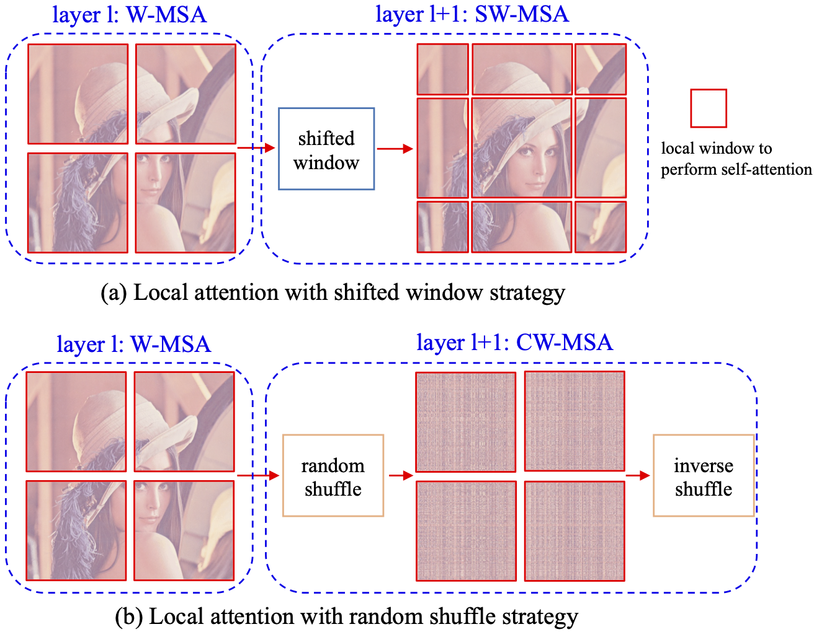
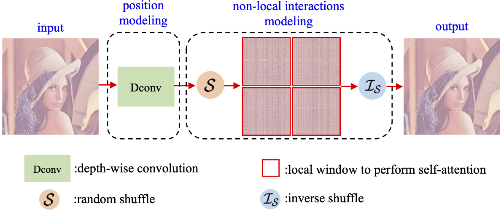
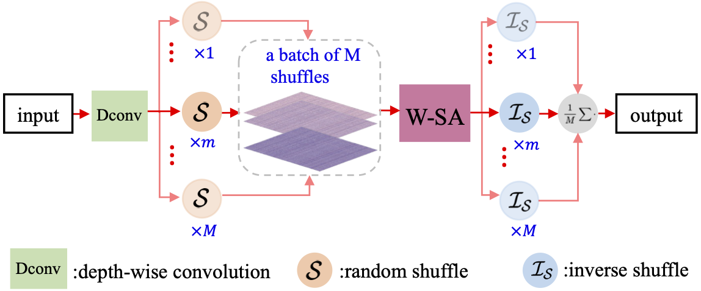

# Random Shuffle Transformer for Image Restoration (ICML 2023)
 <b><a href='https://jiexiaou.github.io'>Jie Xiao</a>, <a href='https://xueyangfu.github.io'>Xueyang Fu</a>, <a href='https://manman1995.github.io'>Man Zhou</a>, Hongjian Liu, Zheng-Jun Zha</b>

Paper: [Link](https://proceedings.mlr.press/v202/xiao23a/xiao23a.pdf)
## Method Overview


## Training Strategy


## Testing Strategy


## Pretrained Model
- SIDD [Google Drive](https://drive.google.com/file/d/1rK_fwwz70DBoYIR-KqBLB14qC_cXegQD/view?usp=sharing)
- SPA [Google Drive](https://drive.google.com/file/d/1C8ob3_QBUqcc_RpJf2W4Rap0-a3GUE3_/view?usp=sharing)
- GoPro [Google Drive](https://drive.google.com/file/d/1S5TcBAzDqzOT9i8WeDwx4O_R1aSxTKQL/view?usp=sharing)

## train
```
python train/train_motiondeblur.py --arch ShuffleFormer_B --gpu '0,1,2,3' --batch_size 16 --train_ps 256 --train_dir GoPro/train --embed_dim 32 --warmup --nepoch 600 --save_dir save_dir --val_dir GoPro/val --train_workers 4 --weight_decay 0.0 --optimizer adam
```
## test
```
# denoise
python test_sidd.py --arch ShuffleFormer_B --gpu '0' --val_dir data_path --pretrain_weights model_path --result_dir save_dir --repeat_num 16
# deblur&derain
python test.py --arch ShuffleFormer_B --gpu '0' --val_dir data_path --pretrain_weights model_path --result_dir save_dir --repeat_num 16
# evaluate: test/eval_spa.m eval_gopro.m(gopro&hide) eval_realblur.py(RealBlurR&RealBlurJ) evaluation code is borrowed from Restormer(https://github.com/swz30/Restormer)
```

## Acknowledgement
We refer to [Uformer](https://github.com/ZhendongWang6/Uformer) and [Restormer](https://github.com/swz30/Restormer). Thanks for sharing.

## Contact
Please contact us if there is any question(ustchbxj@mail.ustc.edu.cn).

